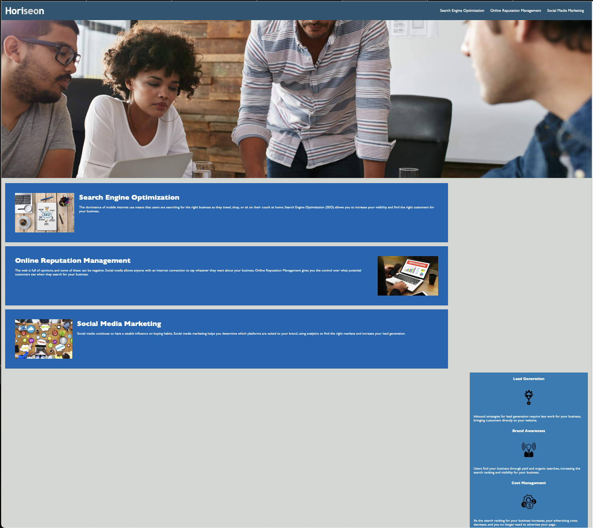

# Horiseon-Refactor

## Description
For this project I was asked to refactor starter code. The website already functioned as needed, but there were standards that needed to be implemented within the code itself. The criteria that was need:

    C1. Meets semantic HTML elements criteria (for readability purposes)
    C2. Follows a logical structure independent of styling and positioning 
    C3. Icons and Images have alt attributes (for accessibility purposes and to optimize seo)
    C4. Heading attributes should be in sequential order
    C5. Title element should be concise and descriptive title  

By implementing these standards we are able to optimize the ranking of the website in search engines, ensure accessibilites for users with disabilities and improve the codebase for long-term sustainability and readability. 

## Final Product
